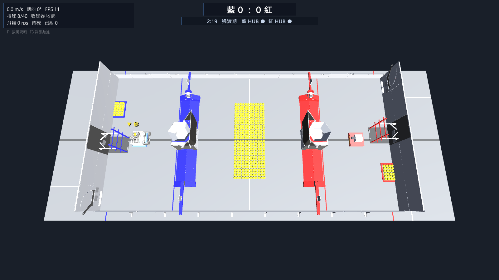
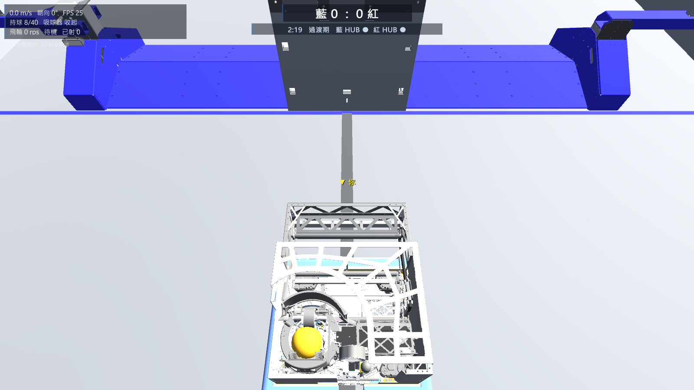
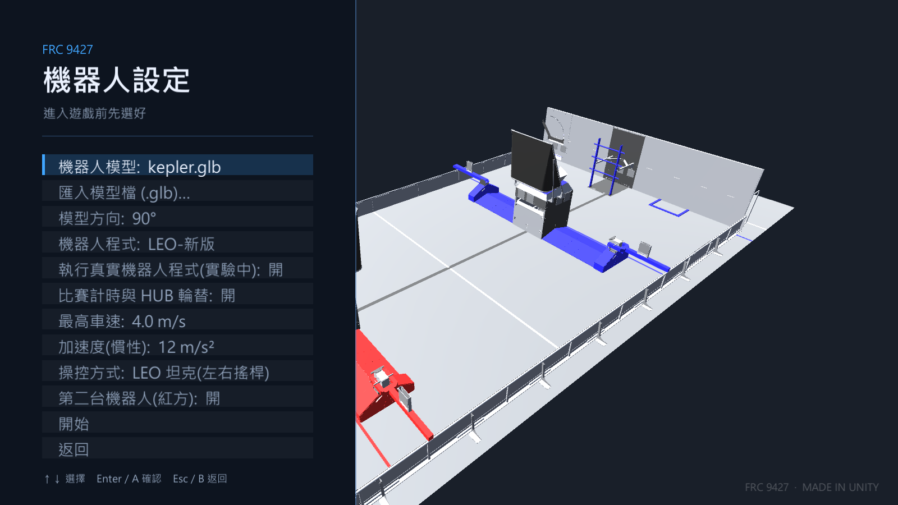
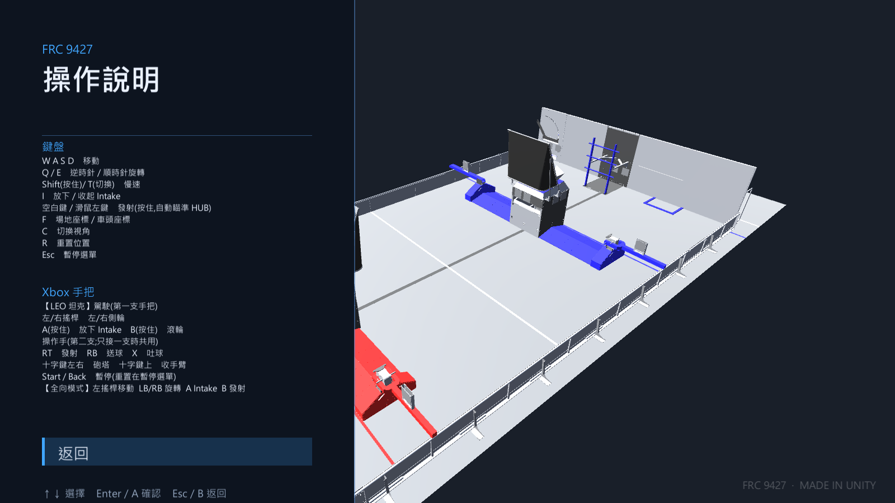

# FRC 9427 模擬器(FRC 2026 REBUILT)

> ⚠️ 請一律下載 [最新版 Release](../../releases/latest)。v0.1.2 以前的舊版沒有「自動檢查更新」,也有已修正的問題(卡住、GPU 燒機)。

FRC 9427 隊自製的 **Unity 桌面模擬器**:官方 2026 REBUILT 場地、FUEL 球物理、HUB 計分與輪替、160 秒比賽計時,
並能**直接執行隊上的 WPILib Java 機器人程式**(把 Unity 當虛擬硬體),不用實體機器人就能練操作、測程式。

## 特色
- **官方場地**:FIRST 官方 2026 REBUILT 場地 CAD(經 AdvantageScope 轉出的 glb);碰撞體逐項對照模型量測(HUB、TRENCH、BUMP、TOWER、DEPOT)。
- **球物理**:FUEL 起始擺法取自場地模型;HUB 計分、輪替、倒數計時。
- **兩種操控**:LEO 坦克(左右搖桿各控一側)/ 全向 swerve;**1~2 支 Xbox 手把**(第一支駕駛、第二支操作手),另有鍵盤。
- **真實機器人程式模式**:執行 Java 專案(HALSim WebSocket + 同進程馬達物理 agent),支援 swerve + Talon 與 坦克 + SparkMax(SparkMax 自動換成模擬替身)。
- **像遊戲一樣的更新**:主畫面按 U 只下載「差異更新包」(通常不到幾 MB)並自動重新開啟。
- **效能友善**:幀率上限、超取樣畫質、陰影開關、依 GPU 自動選預設、自動降級;筆電可一鍵設成高效能顯卡。
- **自動測試**:開車、BUMP、隧道、貼牆、球堆、長時間 soak、LEO 真實程式⋯⋯(見 [架構說明](docs/ARCHITECTURE.md))。

| 跟隨視角 | 機器人設定 | 操作說明 |
|---|---|---|
|  |  |  |

## 下載(Windows)
到 [Releases](../../releases/latest) 下載最新的 `FRC9427-Sim-win64-vX.Y.Z.zip` → 解壓縮 → 雙擊 `FRC9427-Sim.exe`。
筆電有獨顯(如 RTX)的話,先雙擊 `Set-High-Performance-GPU.bat` 一次。
操作方式見 zip 內的 `使用說明.txt`。程式啟動時會檢查有沒有新版:主畫面出現「有新版」時按 U,會自動下載「差異更新包」並重新開啟,不用重新下載整包(v0.1.4 起支援)。

### 常見問題
- **Windows 跳出「Windows 已保護您的電腦」(SmartScreen)**:程式沒有數位簽章(學生專案)。點「其他資訊」→「仍要執行」。解壓縮出來的檔案若被標記「來自網路」,可對 zip 按右鍵 → 內容 → 勾「解除封鎖」再解壓縮。
- **執行自己的機器人程式**:需要已安裝 WPILib 2026(`C:\Users\Public\wpilib\2026`)。在「機器人設定」選專案資料夾(內有 `gradlew.bat`),開「執行真實機器人程式」。第一次要編譯,約 20~60 秒。
- **FPS 太低 / 風扇狂轉**:設定 → 降低畫質(超取樣 100%)、關陰影、幀率上限 60;筆電請先雙擊 `Set-High-Performance-GPU.bat`。
- **球或車被「看不見的牆」卡住**:請回報位置(座標)到 Issues,場地碰撞體是對照官方模型逐項量測的,有誤差會修。

## 從原始碼建置
- Unity 6000.6.3f1,專案根目錄直接開啟。
- 命令列打包:`Unity.exe -batchmode -nographics -quit -projectPath <本資料夾> -executeMethod BuildTool.BuildWindows`(輸出在 `Build/`)。
- 自動測試與架構:見 [docs/ARCHITECTURE.md](docs/ARCHITECTURE.md)。
- 發新版:改 `UpdateCheck.cs` 的 `Current` → 打包 → `powershell -File Tools\publish-release.ps1 -Version X.Y.Z -Notes "..."`。

## 授權與素材
- 場地模型:FIRST 官方 2026 REBUILT 場地 CAD(經 AdvantageScope 轉出的 glb)。
- 機器人模型(Kepler 等)為各隊公開的 CAD,版權屬原作者,不在原始碼倉庫內(`ImportSamples/` 已排除),只隨 Release 的 zip 提供。
- 本專案是學生專案,與 FIRST 無關聯。
